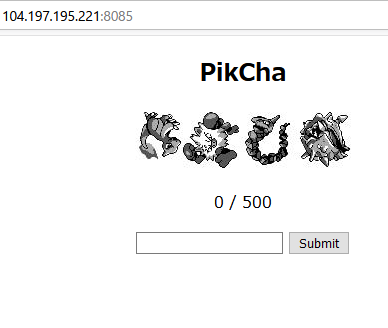

# PikCha2

```txt
No more mistakes! No we'll see who's the best pokemon master out there!
http://104.197.195.221:8085
```

## Solution

問題にアクセスすると、`2.PikCha` の問題と同じようなページが表示されました。



今回は Cookie の `session` には、順番の答えや画像が含まれていませんでした。

```http
POST / HTTP/1.1
Host: 104.197.195.221:8085
 ...
Cookie: session=d9e18920-3041-4db3-b4d8-a96b84e05eb0
Upgrade-Insecure-Requests: 1

guess=3
```

```http
GET / HTTP/1.1
Host: 104.197.195.221:8085
 ...
Cookie: session=d9e18920-3041-4db3-b4d8-a96b84e05eb0
Upgrade-Insecure-Requests: 1

```

```http
GET /static/chall-images/xoWvuwfBeB.jpg HTTP/1.1
Host: 104.197.195.221:8085
 ...
Cookie: session=d9e18920-3041-4db3-b4d8-a96b84e05eb0

```


<br>

[writeups](https://ctftime.org/writeup/26806)

## Flag

flag : `UMASS{1ts_m3_4nd_y0u!!P0k3m0n}`