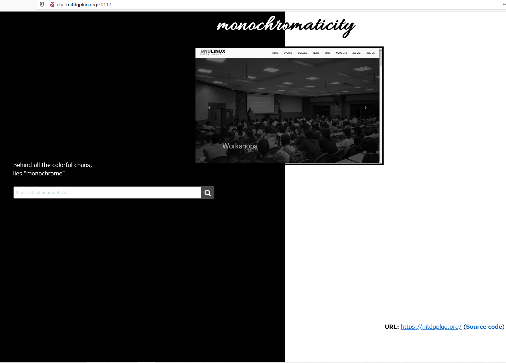

# Monochrome

```txt
Behind all the colorful chaos, lies /monochrome/ P.S. flag is at /home/flag
http://chall.nitdgplug.org:30112
```

## Solution

問題にアクセスすると URL を入力する箇所とそのサイトの画面、そしてソースコードを表示するリンクがあります。



試しに `http://example.com` と入力してみると想定通り表示されました。


ここでこのサイトには、SSRF があるのではないかという推測ができます。

試しに ファイルスキームで `file:///etc/passwd` と入力して `Source code` をクリックしてアクセスしてみると、そのまま実行結果が `source.html` に表示されました。


どうやら入力値のスキームチェックがされていなくて、 SSRF から Path Traversal が実行できていることがわかります。

今回は、問題文より `/home/flag` の位置に flag があることがわかっています。

なので URL の入力欄に `file:///home/flag` と入力して、`Source code` から `source.html` にアクセスしてみると flga を得ることができました。


## Flag

flag : `GLUG{H0RIZ0N74LLY_V3R7IC4LLY_8923123}`
