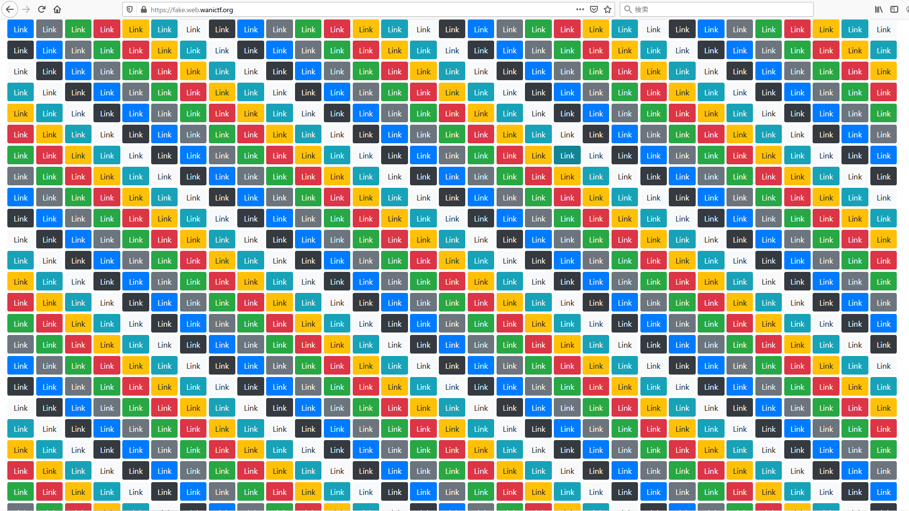

# 1.fake

```txt
偽物を見破れますか？
https://fake.web.wanictf.org
Writer : hi120ki
```

## Solution

問題にアクセスすると、大量のリンクボタンが表示されます。



ページのソースを見てみると、以下のように一か所リンクが埋め込まれているのがわかります。

```html
    <a href="144c9defac04969c7bfad8efaa8ea194.html" style="display: none;">
      <button type="button" class="btn btn-primary">Link</button>
    </a>
```

なのでこのページにアクセスすると、flagを得ることができます。

```shell
$ curl https://fake.web.wanictf.org/144c9defac04969c7bfad8efaa8ea194.html
<!doctype html>
<html lang="ja">

<head>
  <meta charset="utf-8">
  <meta name="viewport" content="width=device-width, initial-scale=1, shrink-to-fit=no">
  <link rel="stylesheet" href="https://stackpath.bootstrapcdn.com/bootstrap/4.5.0/css/bootstrap.min.css">

  <title>FLAG</title>
  <meta name="robots" content="noindex, nofollow">
</head>

<body>
  <div class="container">
    <h1>secret page</h1>
    <code>FLAG{wow_y0u_h4ve_3po4ted_th3_7ake}</code>
  </div>
</body>

</html>
```

## Flag

```txt
FLAG{wow_y0u_h4ve_3po4ted_th3_7ake}
```
