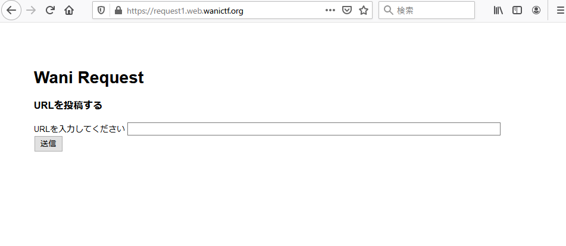

# 2.Wani Request 1

```txt
RequestBinを使ってみよう!!
https://request1.web.wanictf.org/
この問題ではあどみんちゃんから自分のサーバにアクセスしてもらう必要があります。
自前でサーバを用意するのが難しい方はRequestBinなどのサービスを利用してみましょう。
サーバが用意出来たらいよいよ本番です。
問題ページにアクセスし、あなたが用意したサーバのURLを送信してください。
送信するとあどみんちゃんの秘密のページにあなたの送信したURLのリンクが表示されます。
あどみんちゃんは表示されたリンクをクリックしてあなたのサーバにアクセスしてくれます。
あどみんちゃんからのアクセスを分析して秘密のページを探してみてください。

HINT1 : HTTP ヘッダー
HINT2 : xss問題ではありません。

Writer : nkt
```

## Solution

問題にアクセスすると、URLを入力して送信できる欄が表示されます。



試しに、`http://example.com`と入力してみると以下のようにリクエストとレスポンスが送られています。

```http
POST / HTTP/2
Host: request1.web.wanictf.org
User-Agent: Mozilla/5.0 (Windows NT 10.0; Win64; x64; rv:88.0) Gecko/20100101 Firefox/88.0
Accept: text/html,application/xhtml+xml,application/xml;q=0.9,image/webp,*/*;q=0.8
Accept-Language: ja,en-US;q=0.7,en;q=0.3
Accept-Encoding: gzip, deflate
Content-Type: application/x-www-form-urlencoded
Content-Length: 54
Origin: https://request1.web.wanictf.org
Referer: https://request1.web.wanictf.org/
Upgrade-Insecure-Requests: 1
Te: trailers
Connection: close

url=http%3A%2F%2Fexample.com&submit=%E9%80%81%E4%BF%A1
```

```http
HTTP/2 200 OK
Content-Type: text/html; charset=utf-8
Date: ******
Etag: W/"e-SLv5QWH16zfnxsz3eX1e0sU6ME4"
X-Powered-By: Express
Content-Length: 14

URL received.
```

問題文にあるように RequestBin というサービスを利用して、用意したサーバのURLを送信してみます。

すると、サーバに送られてきたレスポンスの referer ヘッダに、AWS の S3 バケットのリンクをあることがわかります。

```http
response.body.headers.referer
http://w4ni-secre7-h1mitu-pa6e.s3-website-ap-northeast-1.amazonaws.com/?url=https://en1izb0icnjm8x7.m.pipedream.net/
```

アクセスしてみると、flagを得ることができました。

```shell
$ curl http://w4ni-secre7-h1mitu-pa6e.s3-website-ap-northeast-1.amazonaws.com/
<!DOCTYPE html>
<html>

<head>
  <title>Wani Admin Secret page</title>
  <link rel="stylesheet" href="https://cdn.jsdelivr.net/npm/bootstrap@4.6.0/dist/css/bootstrap.min.css">
</head>

<body>
  <div class="container mt-3">
    <h1>Wani Admin Secret page</h1>
    <code>FLAG{h77p_r3f3r3r_15_54f3_42a2cc2f275}</code>
    <div id="link"></div>
  </div>
  <script>
    let url = new URL(window.location.href);
    let param = url.searchParams.get('url');
    if (param) {
      document.getElementById("link").innerHTML = '<a href="' + param + '">link</a>'
    }
  </script>
</body>

</html>
```

## Flag

```txt
FLAG{h77p_r3f3r3r_15_54f3_42a2cc2f275}
```
